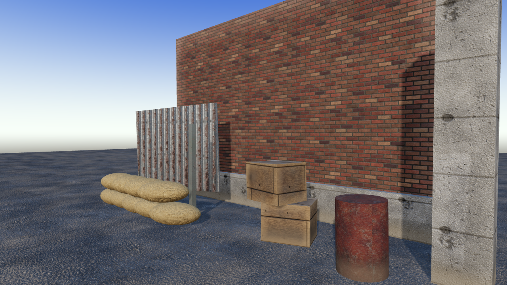
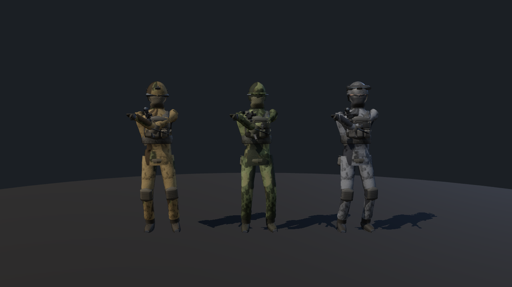
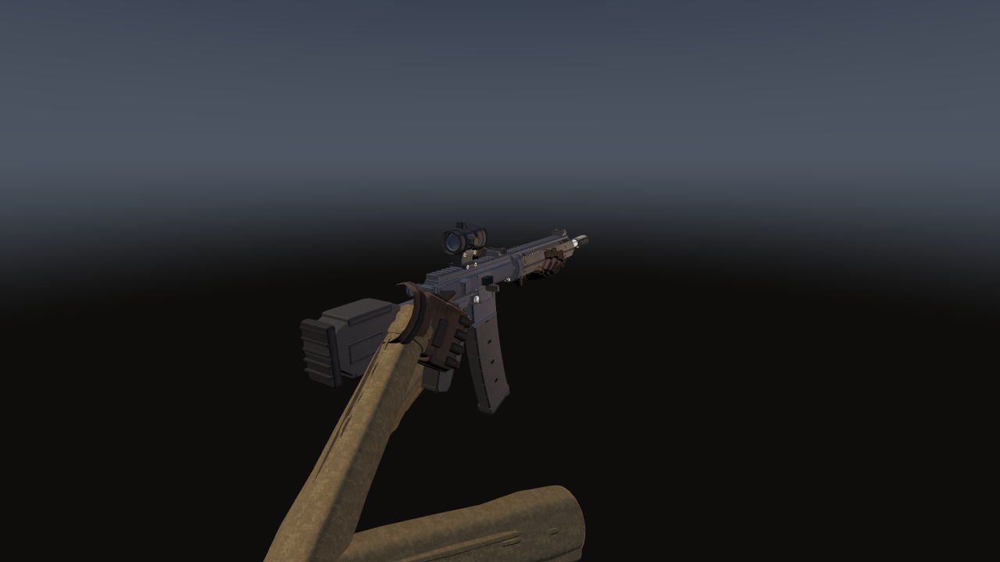
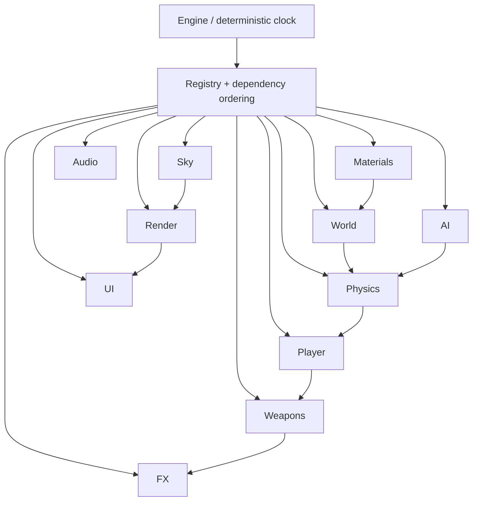
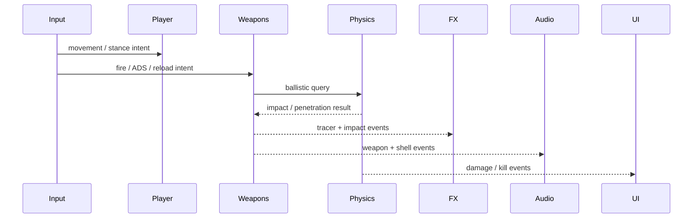

<div align="center">

# PROF-OF-DUTY™

**A procedural first-person tactical-shooter vertical slice for the browser**

[](#technical-overview)
[](#technical-overview)
[](#project-status)
[](LICENSE)




Created, directed, engineered, and maintained by **Profexor**

[Quick start](#quick-start) · [Controls](#controls) · [Gallery](#gameplay-gallery) · [Architecture](#architecture) · [Performance](#performance) · [Roadmap](#development-roadmap)

</div>

---

## Project status

Prof-Of-Duty is a **playable but incomplete** first-person shooter prototype.
It is a technical vertical slice and long-term game-development foundation,
not a finished commercial release. The current build supports movement,
shooting, ADS, reloads, procedural opponents, combat feedback, enterable
spaces, synthesized audio, and a complete WebGL post-processing stack.

The codebase contains approximately **69,500 lines of first-party JavaScript
and tooling across 11 runtime subsystems**. Every runtime texture, mesh,
animation, effect, and sound is generated procedurally from code.

There are no downloaded art, model, HDRI, image, or audio assets in the game
runtime. The only runtime package dependency is `three`.

## Quick start

```bash
npm ci
npm run dev          # http://127.0.0.1:5173
```

WebGL2 and pointer-lock support are required.

## Controls

| Input | Action |
|---|---|
| `W A S D` | Move |
| Mouse | Aim / look |
| Left mouse | Fire |
| Right mouse | Aim down sights |
| `R` | Reload |
| `Shift` | Sprint |
| `Ctrl` | Crouch |
| `Space` | Jump / traversal |
| `Q` / `E` | Lean left / right |
| `Esc` | Release pointer lock |

## Gameplay gallery

All images below are deterministic technical-art captures generated by this
repository's standalone subsystem harnesses—not promotional mockups—and stored
locally so they render on GitHub.

| Procedural world/material kit | Procedural combatant lineup |
|---|---|
|  |  |

| Procedural weapon viewmodel |
|---|
|  |

## Technical overview

| subsystem | what it does |
|---|---|
| `render` | HDR pipeline, cascaded shadow maps in a `sampler2DArray` with texel snapping and PCSS contact hardening, MRT depth/normal/velocity prepass, GTAO, TAA with YCoCg variance clipping, tile-dilated motion blur, Karis bloom pyramid, GPU EV100 metering, procedural 33³ grade LUT, AgX composite |
| `materials` | GPU texture forge: 19 procedural surfaces (concrete, brick, plaster, asphalt, sand, rusted/painted/brushed metal, wood, fabric, burlap, glass…), periodic noise so everything tiles seamlessly, Sobel height→normal, parallax occlusion mapping, triplanar projection, curvature-driven edge wear |
| `sky` | Atmospheric scattering, time of day, PMREM environment generation, volumetric fog and light shafts |
| `world` | ~120×120 m market street: modular building kit with real wall thickness, enterable interiors, several hundred instanced props |
| `physics` | Written from scratch, no library. Binned-SAH BVH (29k tris → 14k nodes in 22 ms, 0.25 µs/raycast), swept-capsule character controller with a 5-plane crease stack, impulse rigid bodies with CCD, PBD ragdolls, multi-layer bullet penetration |
| `player` | Movement state machine, slide/mantle/lean, camera feel |
| `weapons` | Procedural weapon geometry, viewmodel rig, ADS, spring recoil, procedural reloads, ballistics with travel time and drop |
| `fx` | GPU particles, decals, tracers, muzzle flash, explosions |
| `ai` | Skinned soldiers, navmesh pathing, perception, cover behaviour, ragdoll death |
| `ui` | DOM/CSS HUD: crosshair, hitmarkers, minimap, compass, killfeed |
| `audio` | Web Audio synthesis — no sound files. Layered weapon fire, convolution reverb, HRTF spatialisation, occlusion |

[`ARCHITECTURE.md`](ARCHITECTURE.md) defines subsystem interfaces, directory
ownership, cross-system events, resource lifetimes, and shared surface types.

## Architecture



The runtime communicates through a small event vocabulary rather than direct
cross-directory imports:



## Tooling

The validation harness is a first-class part of the project:

| tool | purpose |
|---|---|
| `tools/capture.mjs` | Screenshot one named shot via GPU-backed headless Chromium |
| `tools/shotset.mjs` | All 11 shots in one session — fast review set |
| `tools/baseline.mjs` | **Reproducible** capture: each shot in an isolated page, fixed frame budget. Bit-identical across runs |
| `tools/imagediff.mjs` | Per-pixel gate. Exits non-zero if any pixel moved |
| `tools/profile.mjs` | Gameplay profiler at real device pixel ratio. Frame-time *distribution* and hitch attribution via per-frame WebGL program counts |
| `tools/playtest.mjs` | Scripted movement/fire smoke test |

### Current validation

| Gate | Verified result |
|---|---|
| Production install | 0 known production vulnerabilities |
| Production build | 145 modules transformed successfully |
| AI procedural geometry | All tested components finite; 25-bone rig valid |
| Physics | 55/55 checks pass, including BVH, CCD, penetration, ragdolls, and determinism |
| Documentation images | Local-path integrity enforced in CI |
| Ownership metadata | Profexor MIT/trademark integrity enforced in CI |

Two findings worth recording, because both invalidated earlier measurements:

**Median frame time hides the actual problem.** A static-camera benchmark reported
94 fps while the game was unplayable. Real gameplay at Retina DPR (internal 3.34 MP,
not 2.07) ran 12–17 fps with **728–1236 ms stalls** caused by 34+ WebGL programs
compiling lazily mid-frame. `profile.mjs` reports p50/p95/p99 and attributes each
hitch, which is what surfaced it.

**Captures were not reproducible.** `shotset.mjs` reuses one page across all 11
shots, so particle age, decal buffers and exposure state leak forward — two identical
runs differed on 10 of 11 shots. `baseline.mjs` isolates each shot in a fresh page,
which is bit-identical and is what makes `imagediff.mjs` a usable gate.

## Performance

Measured on an Apple silicon laptop at 1512×982, DPR 2 (3.34 MP internal), `ultra` preset,
3 runs, gameplay in motion with AI and firing active:

| | before optimization | after |
|---|---|---|
| fps p50 | 12–17 | **28–30** |
| fps p99 | 4–9 | **14–17** |
| worst frame | 728–1236 ms | **66–82 ms** |
| shader compiles during play | 34–35 | **0** |
| boot | ~9–12 s | **3.7–4.6 s** |

The optimization pass was constrained to produce **zero visual change**, enforced by
`imagediff.mjs` rather than by assertion — the shipped build is bit-identical to its
pre-optimization reference across all 11 shots.

Shader pre-warm (`src/core/prewarm.js`) is what removed the stalls. Making it
*provably* pixel-neutral required first fixing subsystems that animated off
`performance.now()` instead of the engine clock, since any change to boot duration
otherwise shifted output.

## Honest assessment

The long-term target is the presentation and tactile quality associated with
modern AAA tactical shooters. **The current prototype does not yet reach that
bar.**

Eleven independent adversarial critics scored the frames against that bar. Scores
went 3.59 → 4.14 → 4.05 → **5.05** out of 10. Two shots reached "CLOSE"; the rest
remain "AMATEUR". In blind comparisons, reviewers consistently preferred
the commercial reference frames.

Where it falls short, specifically:

- **Hands.** Blocky finger slabs that don't convincingly grip the weapon.
- **Material richness.** Surfaces read as procedural noise rather than photographed
  reality at close range — the ceiling of generating texture from code.
- **Characters.** Enemies read as mannequins at distance.
- **Indirect light.** An approximation, not real GI.
- **Frame rate.** 28–30 fps at Retina. The art passes tripled geometry cost
  (5.9M → 11.3M triangles) and optimization recovered about half.

A known root cause remains unfixed: the viewmodel light rig in `render/index.js`
delivers roughly 20× the irradiance per unit albedo that the world does — a plain
*black* material in the view scene renders at L=110 against a background of 91,
purely from F0=0.04. Every weapon albedo is cheated to a third of physical to
compensate, which caps material separation on the most-looked-at object in the game.

## Process note

Sequential single-owner passes beat parallel fan-out decisively. Three rounds of six
agents each owning one directory moved the score +0.46 and left frame-ruining defects
*higher* than they started (60 → 47 → 66), because tonemapping, sky and indirect light
are one coupled system and isolated agents kept breaking each other's assumptions.
One sequential pass with a single owner per coupled concern moved it +1.00 and cut
defects 66 → 26.

The most valuable single result came from an agent contradicting its own brief. Every
critic for three rounds reported the weapon as "untextured". It wasn't — it was
specular-dominated, with the diffuse term measured at L=26 against a shipped L=67.
Prior rounds had been crushing albedos to fight bright-part complaints, which killed
diffuse and made it worse. The fix was the opposite of what was asked for.

## Development roadmap

Near-term and long-term delivery gates are maintained in
[`ROADMAP.md`](ROADMAP.md). The highest-priority work is:

- correct the viewmodel/world irradiance mismatch;
- improve hands, enemy silhouettes, and close-range materials;
- recover performance on integrated GPUs and high-DPI displays;
- add objectives, match flow, settings, gamepad support, and save-state;
- expand automated browser, audio, gameplay, and accessibility coverage.

## Documentation

| Document | Purpose |
|---|---|
| [PROJECT_BRIEF.md](PROJECT_BRIEF.md) | Product direction and current scope |
| [ARCHITECTURE.md](ARCHITECTURE.md) | Runtime contracts and subsystem boundaries |
| [ROADMAP.md](ROADMAP.md) | Planned enhancements and measurable gates |
| [CONTRIBUTING.md](CONTRIBUTING.md) | Engineering and asset rules |
| [SECURITY.md](SECURITY.md) | Private vulnerability reporting |
| [THIRD_PARTY_NOTICES.md](THIRD_PARTY_NOTICES.md) | Dependency licenses and boundaries |
| [TRADEMARKS.md](TRADEMARKS.md) | Prof-Of-Duty™ usage policy |
| [CHANGELOG.md](CHANGELOG.md) | Notable project changes |

## Credits and legal

**Project concept, direction, engineering, technical art, game design,
documentation, and ownership: Profexor.**

Project-owned source code and documentation are released under the
[MIT License](LICENSE), copyright © 2026 Profexor. Prof-Of-Duty™ is a
trademark of Profexor; the MIT license does not grant trademark rights or
permission to imply endorsement. Dependencies retain their own licenses as
listed in [THIRD_PARTY_NOTICES.md](THIRD_PARTY_NOTICES.md).

---

<sub>Prof-Of-Duty™ is a trademark of Profexor. Copyright © 2026 Profexor. Project-owned source and documentation are available under the [MIT License](LICENSE); that license grants no trademark rights. Third-party software and marks retain their respective rights.</sub>
